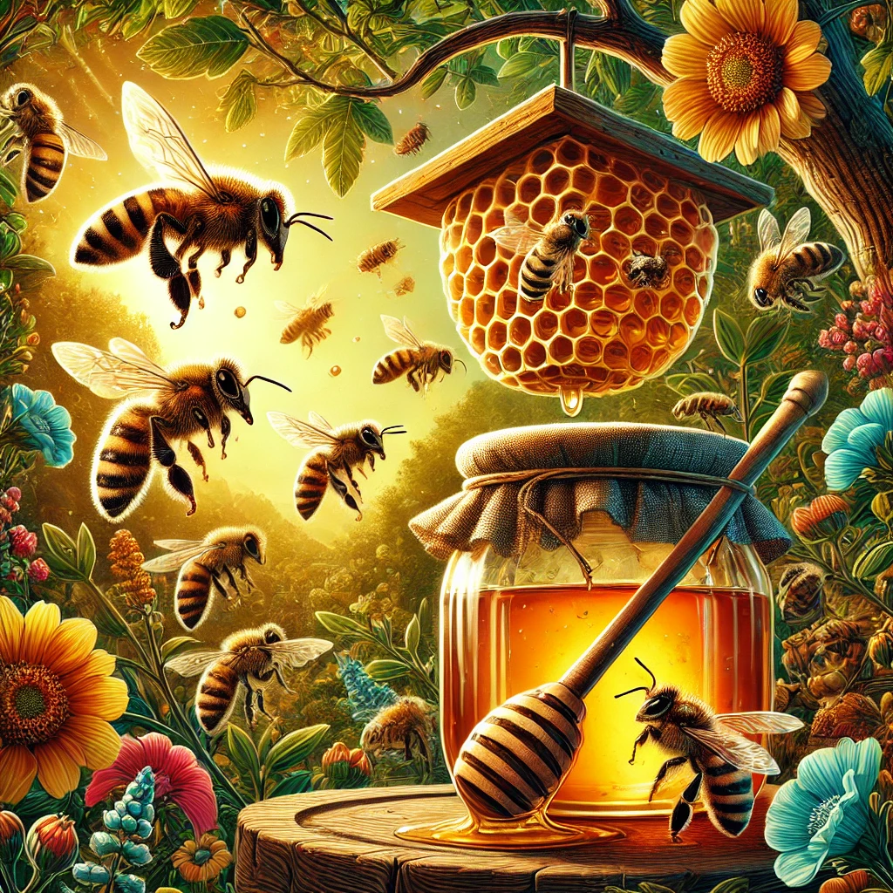

Project Hive 🐝

# Agricultural Data Science & Analystics 
This repository hosts AI/ML algorithms that use data from the **National Agricultural Statistics Service (NASS)**, the primary data science and statistics body for the U.S. Department of Agriculture (USDA). The first analysis focuses on **honey production** in the United States, leveraging historical datasets to identify production trends, regional variations, and predictive insights.



# Value Proposition🪙
Agricultural data is critical for policymakers, farmers, investors, and researchers. By applying AI/ML models to USDA NASS datasets, we can:
- Provide **data-driven insights** into agricultural production and supply chains.  
- Improve **forecasting accuracy** for commodities like honey, reducing uncertainty for producers and distributors.  
- Enhance **decision-making** at the enterprise and policy level with predictive analytics and visualization tools.  
- Democratize access to **trusted, government-certified agricultural data** through advanced machine learning techniques.  

# Table of Contents📖
- [Value Proposition](#value-proposition)
- [Features](#features)
- [Tech Stack](#tech-stack)
- [Prerequisites](#prerequisites)
- [Enterprise Use Cases](#enterprise-use-cases)
- [License](license.txt)
- [Contact](#contact)
- [Acknowledgements](#acknowledgements)

# Features✨
- **Data Ingestion & Cleaning**: Automated ETL pipelines to pull and preprocess USDA NASS data. 
- **Exploratory Data Analysis (EDA)**: Statistical summaries, trend identification, and visualization of honey production data.  
- **Predictive Modeling**: Time-series forecasting and regression models for production and yield estimates.  
- **Geospatial Analysis**: Mapping honey production by state with interactive visuals.  
- **Scalable Framework**: Extendable to other NASS datasets ans scenarios (e.g., sustainabile agriculture, organic farming, fruits, vegetables, livestock, wholesalers, and retailers).  
- **Reproducibility**: Jupyter notebooks and scripts are structured for transparency and replication.  

# Tech Stack🛠
- **Data Sources**: USDA NASS API, public JSON/CSV datasets  
- **Languages**: Python, Bash
- **Libraries**: NumPy, Pandas, PyTorch, Scikit-learn, TensorFlow, XGBoost
- **DevOps**: GitHub 
- **UX/UI Visualization**: CSS3, HTML5, Kotlin, Matplotlib, Plotly, Seaborn, Swift

# Prerequisites
- Python 3.10+
- USDA NASS API key 
- Installed dependencies:  
  ```bash
  pip install -r requirements.txt

# Enterprise Use Cases📈
- Agribusiness & Food Supply Chains. Forecast yields to optimize sourcing, logistics, and inventory planning.
- Policy & Government Agencies. Support decision-making with accurate, transparent agricultural production models.
- Financial Institutions & Investors. Assess agricultural risk, investment opportunities, and market forecasting.
- Sustainability & Environmental Studies. Analyze honeybee population health indicators and pollination-related impacts.
- Education & Research. Provide reproducible, open-access workflows for students and researchers in agricultural economics, data science, and sustainability. 
- Supply & Demand. Farms, wholesalers and retailers can forecast capacity to eliminate DOWNTIME and reduce waste. 

# License⚖️
This project is licensed under a dual license. You are free to use, modify, and distribute this software with attribution for personal or research use, but must open source modifications to the community. Integration into closed source, commercial proprietary systems requires a low cost annual subscription and license fees. See license.txt for details. 

# Contact📬
- Name: Abraham Doe
- Email: abrahamdoe@gmail.com
- GitHub: [Portfolio](https://github.com/BlackArsenic88?tab=repositories)

# Acknowledgements🙏
- USDA National Agricultural Statistics Service (NASS) for providing the primary data.
- Open-source community for libraries and tools that make reproducible research possible.
- Researchers and policymakers who continue to advance agricultural insights and food security.
- Inspiration from industry leaders in AI/ML models
- I am grateful. Thank you! 

